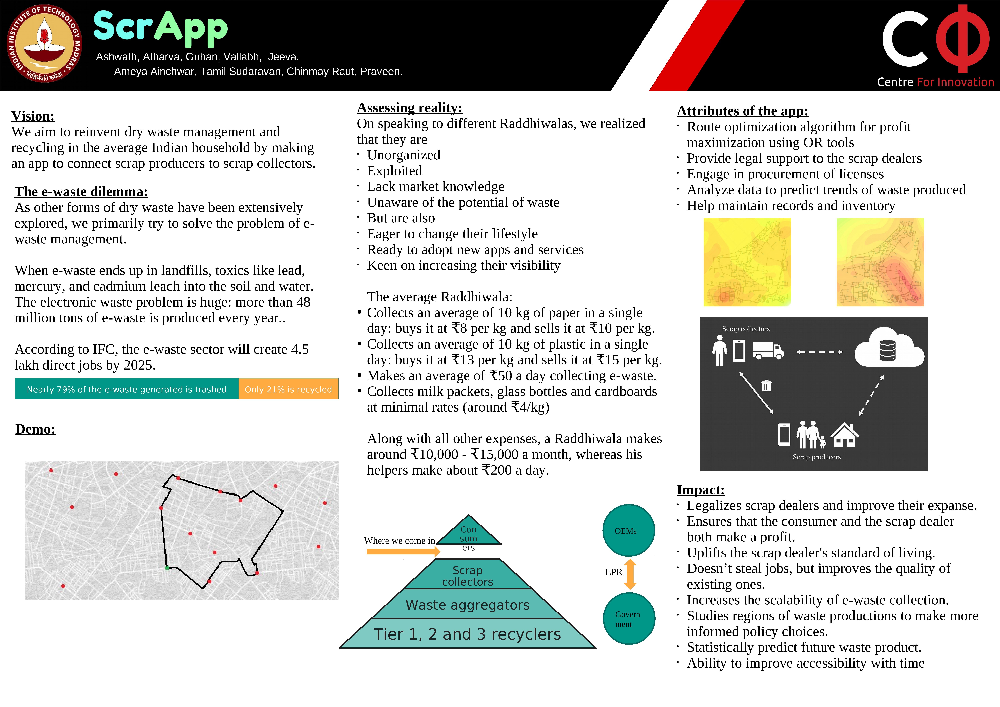

# Ashoka Tech For Change Code
Ashoka Tech for Change repository

# Dependencies
To install all the Node dependencies, run
```
$ cd ./inter-iit-backend
$ npm i
```

Make sure you have the following Python dependencies installed:
- OSMNX
- Google OR Tools

You will also need MySQL 8 up and running on your computer, listening through localhost.

# Poster


